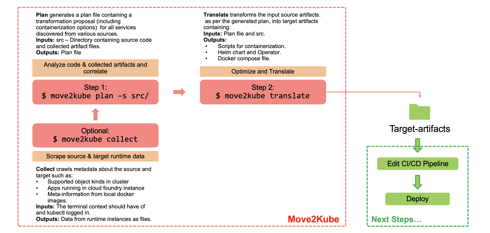

# Move2Kube

Move2Kube is a command-line tool that accelerates the process of re-platforming to Kubernetes/Openshift. It does so by analysing the environment and source artifacts, and asking guidance from the user when required.

## Usage

Instructions can be found [here](./USAGE.md)

## Setup

1. Obtain a recent version of `golang`. Known to work with `1.15`.
1. Ensure `$GOPATH` is set. If it's not set:
   1. `mkdir ~/go`
   1. `export GOPATH=~/go`
1. Obtain this repo:
   1. `mkdir -p $GOPATH/src/`
   1. Clone this repo into the above directory.
   1. `cd $GOPATH/src/move2kube`
1. Build: `make build`
1. Run unit tests: `make test`

## Artifacts Required

| Source | Artifact available | Features supported |
|:-------|:-------------------|:-------------------|
| Cloud Foundry | Manifest files | Containerization options from buildpacks, Deployment artifacts |
| Cloud Foundry | Manifest files, Source code | Containerization options based on buildpack/source code, Deployment artifacts |
| Cloud Foundry | Manifest files, Source code, Access to running instance | Containerization options based on buildpack/source code, Deployment artifacts, Metadata from runtime |
| Cloud Foundry | Access to running instance |  Metadata from runtime, Containerization options based on buildpack, Deployment artifacts |
| Docker Compose/Swarm | Docker compose files | Deployment artifacts |
| Docker Compose/Swarm | Docker compose files, Docker images | Deployment artifacts, Ability to enhance images to run in secure environments like Openshift. |
| Source Directories | Source code with no source metadata |  Containerization options based on source code, Deployment artifacts |
| Any source | Access to target cluster | Ability to create artifacts customized for that particular cluster with the most preferred GroupVersion for the kind. |

## Output

* Containerization scripts
  * Dockerfile
  * Source 2 Image (S2I)
  * Cloud Native Buildpack
* Deployment artifacts
  * Kubernetes/Openshift Yamls
  * Helm charts
  * Operator
  * Docker compose
